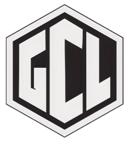

# GField Construction Website



A modern construction company website built with [Next.js](https://nextjs.org) and bootstrapped with [`create-next-app`](https://nextjs.org/docs/app/api-reference/cli/create-next-app).

## Getting Started

First, run the development server:

```bash
npm run dev
# or
yarn dev
# or
pnpm dev
# or
bun dev
```

Open [http://localhost:3000](http://localhost:3000) with your browser to see the result.

## Features

- **Modern Design**: Built with React and Tailwind CSS
- **Contact Form**: Integrated with [Web3Forms](https://web3forms.com) for serverless email handling (no backend required!)
- **Responsive**: Mobile-first design that works on all devices
- **Optimized Fonts**: Uses [`next/font`](https://nextjs.org/docs/app/building-your-application/optimizing/fonts) with [Geist](https://vercel.com/font)

## Tech Stack

- **Framework**: Next.js 14+ (React)
- **Styling**: Tailwind CSS
- **Icons**: Lucide React
- **Email Service**: Web3Forms (serverless)